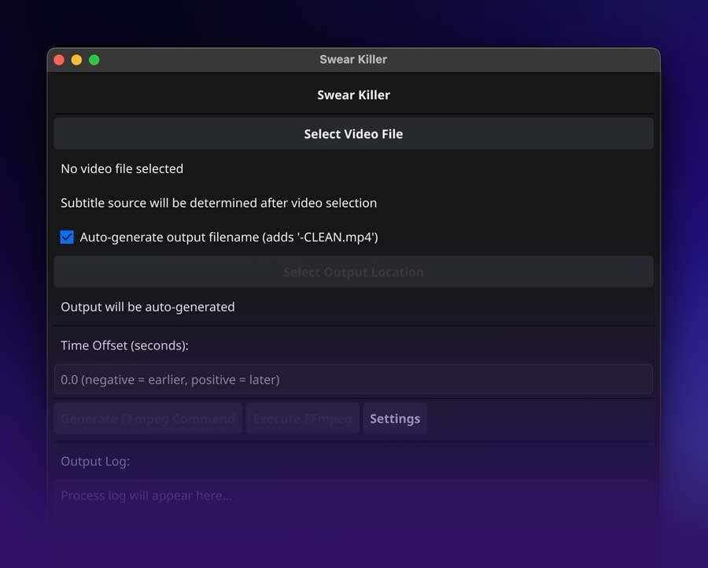

# Swear Killer



A GUI application for automatically removing profanity from video files by muting audio during detected swear words. The app analyzes subtitle files (SRT) to identify timestamps containing profanity and generates FFmpeg commands to selectively mute those segments.

## Features

- **Embedded Subtitle Detection**: Automatically detects and extracts embedded subtitles from video files
- **VLC-Style Subtitle Selection**: Shows subtitle tracks with language and title information like VLC media player
- **Smart Workflow**: Video-first approach with automatic subtitle detection
- **Real-time Progress**: Live progress bar during video processing
- **Customizable Swear List**: Manage your own list of words to filter
- **Multiple Output Formats**: Supports various video output formats (MP4, MKV, AVI, etc.)
- **Auto-naming**: Automatically generates output filenames with "-CLEAN" suffix
- **Time Offset**: Adjust subtitle timing with offset controls

## Prerequisites

Before compiling and running the application, ensure you have:

1. **Go 1.19 or later** installed on your system
2. **FFmpeg** installed and available in your system PATH
3. **FFprobe** (usually comes with FFmpeg installation)

### Installing FFmpeg

**macOS (using Homebrew):**
```bash
brew install ffmpeg
```

**Windows:**
Download from [FFmpeg official website](https://ffmpeg.org/download.html)

**Linux (Ubuntu/Debian):**
```bash
sudo apt update
sudo apt install ffmpeg
```

## Compilation

### Clone or Download
Download the source code to your local machine.

### Build the Application
```bash
# Navigate to the project directory
cd swear-killer

# Build the GUI application
go build -o swear-killer-gui gui.go

# Build the command-line version (optional)
go build -o swear-killer main.go
```

### Run the Application
```bash
# Launch the GUI
./swear-killer-gui

# Or run the command-line version
./swear-killer --help
```

## How to Use

### GUI Application

1. **Launch the App**
   ```bash
   ./swear-killer-gui
   ```

2. **Select Video File**
   - Click "Select Video File" button
   - Choose your video file (supports .mkv, .mp4, .avi, .mov, etc.)
   - The app will automatically check for embedded subtitles

3. **Choose Subtitle Source**
   - If embedded subtitles are found, you'll see options like:
     - `English - [English]`
     - `SDH - [English]` (for hearing impaired)
     - `Latin American - [Spanish]`
     - `📁 Upload SRT file manually`
   - Select your preferred subtitle track or upload an external SRT file

4. **Configure Settings** (Optional)
   - Click "Settings" to customize the swear word list
   - Adjust time offset if needed (negative values make cuts earlier)

5. **Generate and Execute**
   - The output location is auto-generated (adds "-CLEAN" to filename)
   - Click "Generate FFmpeg Command" to create the processing command
   - Click "Execute FFmpeg" to start processing
   - Watch the real-time progress bar

### Command-Line Usage

```bash
./swear-killer \
  --srt "/path/to/subtitles.srt" \
  --video "/path/to/video.mkv" \
  --output "/path/to/clean-video.mp4" \
  --offset -0.5
```

**Parameters:**
- `--srt`: Path to SRT subtitle file
- `--video`: Path to input video file
- `--output`: Path for output video file
- `--offset`: Time offset in seconds (negative = earlier, positive = later)

## Supported Video Formats

**Input formats:** Any format supported by FFmpeg (MKV, MP4, AVI, MOV, WMV, etc.)
**Output formats:** MP4 (default), MKV, AVI, MOV, and others

## Embedded Subtitle Support

The app automatically detects embedded subtitles in these common formats:
- **SubRip (.srt)**
- **ASS/SSA**
- **WebVTT**
- **MOV Text**
- **DVD Subtitles**
- **PGS/Blu-ray subtitles**

## How It Works

1. **Subtitle Analysis**: Parses SRT files to find timestamps containing profanity
2. **Timestamp Extraction**: Identifies start and end times for each problematic segment
3. **Segment Merging**: Combines overlapping or adjacent segments for efficiency
4. **FFmpeg Command Generation**: Creates audio filter commands to mute specific time ranges
5. **Video Processing**: Executes FFmpeg to create a clean version with muted audio segments

## Default Swear Words

The application comes with a built-in list of common profanity. You can customize this list through the Settings dialog in the GUI version.

## File Structure

```
swear-killer/
├── gui.go              # GUI application source
├── main.go             # Command-line application source
├── go.mod              # Go module definition
├── README.md           # This documentation
├── swear-killer        # Compiled CLI binary
├── swear-killer-gui    # Compiled GUI binary
└── sample.txt          # Sample swear words file
```

## Configuration

### Settings File
The GUI application stores user preferences in:
- **macOS/Linux**: `~/.swear-killer-settings.json`
- **Windows**: `%USERPROFILE%\.swear-killer-settings.json`

### Custom Swear Words
You can manage your swear word list through:
- GUI: Click "Settings" button to edit the list
- File: Edit the settings JSON file directly
- CLI: Use `--swears` parameter with a text file

## Troubleshooting

### Common Issues

**"FFmpeg not found"**
- Ensure FFmpeg is installed and in your system PATH
- Test with: `ffmpeg -version`

**"No subtitle streams found"**
- Try uploading an external SRT file manually
- Some video formats may not contain embedded subtitles

**Progress bar not working**
- This is usually cosmetic; the processing continues in the background
- Check the log output for actual progress

**GUI threading errors**
- These are warnings and don't affect functionality
- Close and restart the application if UI becomes unresponsive

### Performance Tips

- **Large files**: Processing time depends on video length and complexity
- **SSD storage**: Use SSD storage for input/output files for better performance
- **Multiple tracks**: Choose the most accurate subtitle track for best results

## Contributing

Feel free to submit issues, feature requests, or pull requests to improve the application.

## License

This project is open source. Please check the license file for details.
